Can a Learning Orientation Reduce In-Group Bias?
================
Kaylee Billstone, Paulina Brown, Jaqueline Marroquin, Christian Ozuna,
Kirsten Richards, and Kennedy Zapalac
2023-10-02

# Project Overview

**What is in-group bias and why does it matter?**

In-group bias is the preferential treatment of people with whom you
share a common identity, such as gender, race, or culture. In-group bias
can be harmful when it leads to unfair outcomes, such as when a
perfectly qualified job candidate is not hired because of their race.
Current research is focused on reducing in-group bias to mitigate its
harmful effects.(Wang et al. 2015)

**Our aims:**

Along this line, we are investigating if in-group bias can be influenced
by priming people with a learning versus performance orientation. A
learning orientation is other-focused (trying to get to know another
person), whereas as performance orientation is self-focused (trying to
make a good impression). Other studies have demonstrated that in-group
bias is influenced by the priming received, so we expect the priming our
participants received will affect their in-group bias (Bettencourt,
Charlton, and Kernahan 1997). Specifically, we will:

1.  Determine how perspective taking, empathetic concern, and altruism
    is different among in-group versus out-group members. Do our
    participant’s display an in-group bias such that they have an easier
    time understanding, express more empathy for, and exhibit altruistic
    behavior toward in-group members?
2.  Determine if the priming received (learning versus performance)
    influenced perspective taking, empathetic concern, and altruism
    towards out-group members.

A few other aims we could pursue later:

1.  How does trait-level orientation influence the effectiveness of the
    priming received in reducing in-group bias?
2.  Investigate whether there are gender-related differences in the
    effectiveness of the learning orientation prime in reducing in-group
    bias.
3.  Perform textual analysis on the participants’ responses to the
    person going through a hard time. We could extract additional
    variables, which could be used to understand in-group bias. For
    example, can we use the sentiment expressed to predict how
    empathetic someone rated themselves as? Could we predict if someone
    had received a learning or performance orientation prime based on
    their language? Or does someone’s trait-level orientation strongly
    influence their language usage?

**Our dataset:**

Our dataset can be accessed
[here](https://github.com/kzapalac/SDS322E_project/blob/main/LP_Dictator.csv).
You can also reference the survey outline
[here](https://github.com/kzapalac/SDS322E_project/blob/main/LP_Dictator.pdf)
to understand the dataset better.

The sample includes white adults who identified as male or female, and
the survey was conducted entirely online. Participants were asked to
write a paragraph about themselves, and they received a learning or
performance prime. Next, they read about a gender-matched in-group or
out-group member (e.g., white or black stranger) going through a hard
time. Then, the participants wrote a letter of support to this person,
filled out a 5-item questionnaire about how easy it was to take the
other person’s perspective, a 1-item measure about how much empathetic
concern they felt for the person, and play a one-shot dictate game.
Trait-level learning and performance orientation was also assessed.
There were two quality measures, which may reduce the size of the
dataset, including an attention check and asking whether or not their
responses should be included.

Overall, there are:

- 2 independent variables: in-group/out-group stranger and
  learning/performance orientation

- 3 dependent variables: perspective taking, empathetic concern,
  altruism (via dictator game)

- 2 potential covariates: trait level learning/performance orientation,
  gender

# Exploratory Data Analysis

### In-Group vs. Out-Group Empathetic Concern, Altruism, and Perspective Taking

<!-- --><!-- -->

| inOrOut |   n |     mean |       sd |        se | lower_ci | upper_ci |
|:--------|----:|---------:|---------:|----------:|---------:|---------:|
| in      |  65 | 5.246154 | 1.500320 | 0.1860919 | 4.881414 | 5.610894 |
| out     |  63 | 5.350000 | 1.232677 | 0.1553027 | 5.045607 | 5.654393 |

**Description of graph:** The graphs above display participants’
self-rated empathetic concern for an in-group versus out-group stranger.
Participants were able to rate their empathetic concern on a scale from
1 (none) to 7 (an extreme amount). In the box plot, we can see that the
median response for empathy was slightly greater for users who received
an in-group response or an out-group response, but overall the
empathetic concern expressed across both groups is fairly high. The
in-group had a larger range of empathy levels felt than the out-group.
In the bar graph, we can see that the mean level of empathy for in-group
and out-group responses are almost the same. The summary table tells us
that the mean empathy level for the in-group is 5.25 (+/- 0.365) and the
mean empathy level for the out-group is 5.35 (+/- 0.304). Although
participants exhibit very slightly more empathetic concern for out-group
strangers within this sample, this difference likely isn’t significant
since the error bars overlap. There is a chance that the reason we do
not see a difference in empathy for in and out groups is because of the
way that participants were primed. We explore this more below.

**Hypothesis based on graph:** Whether a participant received an
in-group or out-group response had little to no impact on the level of
empathy they felt for the person they read about.

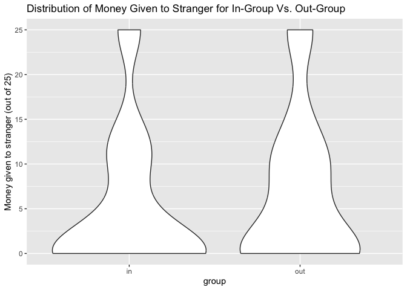<!-- -->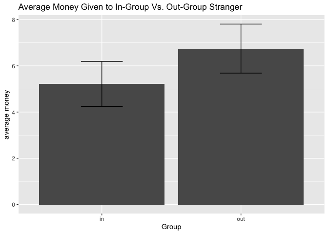<!-- -->

| inOrOut |   n | median |     mean |       sd |        se | lower_ci | upper_ci |
|:--------|----:|-------:|---------:|---------:|----------:|---------:|---------:|
| in      |  65 |      0 | 5.215385 | 7.861084 | 0.9750474 | 3.304292 | 7.126478 |
| out     |  60 |      5 | 6.633333 | 8.123969 | 1.0487999 | 4.577686 | 8.688981 |

**Description of graph:** As part of an altruism test, participants were
compensated with 25 cents for participating in this study, but they were
able to share this money with the stranger they read about. The violin
graph depicted above displays the results of this altruism test. The
in-group is on the left and out-group is on the right within this plot.
Regardless of whether it was an in-group or out-group stranger, most
participants chose to keep the majority of the money for themselves,
represented by the wider distribution at lower values. Participants in
the out-group may have been a little more giving since the distribution
is more spread out. To examine this difference further, we created a bar
plot representing the average money given with error bars. It seems that
people in the out-group condition were slightly more giving on average
in this sample, but this difference may not be represented in the
population since the error bars overlap.

**Hypothesis based on graph:** We hypothesize that there is little to no
in-group bias present in regards to the participants exhibiting
altruistic behavior toward in-group members. People seem no less likely
to give money to an out-group member than they do to an in-group member.
In fact, they may have been slightly more likely to give to give to an
out-group member than an in-group member. This is demonstrated by the
wider distribution at higher values for the violin plot and the greater
mean for the out-group in the bar plot. Perhaps in-group bias is being
obscured in this sample because the learning prime reduced in-group bias
for a portion of the sample.

<!-- --><!-- --><!-- -->

| inOrOut |   n |     mean |        sd |        se | lower_ci | upper_ci |
|:--------|----:|---------:|----------:|----------:|---------:|---------:|
| in      |  65 | 5.880000 | 1.1284946 | 0.1399725 | 5.605654 | 6.154346 |
| out     |  63 | 5.733333 | 0.9823298 | 0.1237619 | 5.490760 | 5.975907 |

**Description of graph:** Participants expressed how easy it was to
understand the perspective of the stranger whose paragraph they read.
They answered 5 questions, and these questions were averaged to obtain
each participant’s average ease of perspective taking. Higher scores
represent better perspective taking. In the violin plot, it looks like
participants in the in-group condition had a slightly easier time take
the perspective because the distribution is wider at the highest values.
The boxplot displays the same thing, but we just wanted to explore the
data in a few ways. Since there didn’t seem to be a clear difference
between the in-group and out-group conditions in the distribution plots,
we created a bar plot to more easily detect a difference. In the
boxplot, it does appear that participants within this sample had a
slightly easier time on average understanding an in-group stranger, but
this difference doesn’t appear to be significant since the error bars
overlap.

**Hypothesis based on graph:** We hypothesize that there isn’t a
difference between people’s understanding of in-group and out-group
strangers because there isn’t a clear difference in the distributions
depicted in the violin plot or in the means in the bar plot. Perhaps the
learning prime was successful, so it’s obscuring the difference in
perspective taking for in-group and out-group strangers.

**Overall, there doesn’t seem to be a difference in people’s empathetic
concern, altruism, or perspective taking for in-group vs. out-group
strangers within this sample, which is counter intuitive given the
well-demonstrated existence of in-group bias. The learning prime may
have been successful in reducing in-group bias, obscuring the difference
unless we separate by both conditions (in-group vs. out-group and
learning vs. performance priming). We explore this below.**

### Influence of Priming on Out-Group Perspective Taking, Empathetic Concern, and Altruism

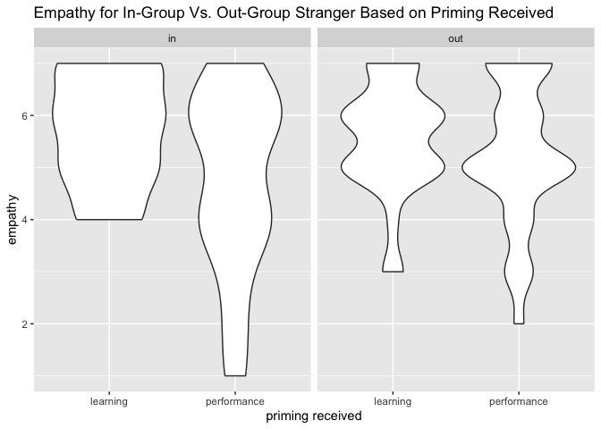<!-- -->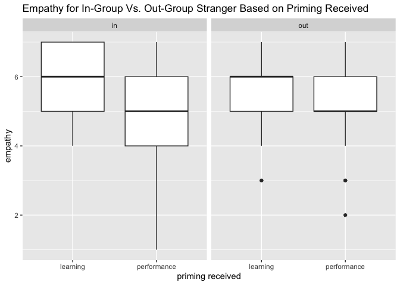<!-- -->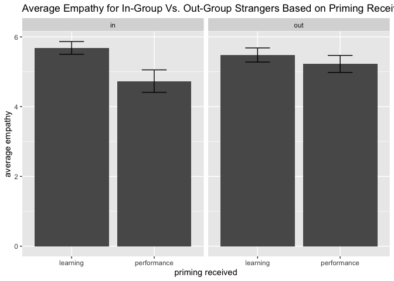<!-- -->

| inOrOut | priming_received |   n |     mean |       sd |        se | lower_ci | upper_ci |
|:--------|:-----------------|----:|---------:|---------:|----------:|---------:|---------:|
| in      | learning         |  35 | 5.685714 | 1.078437 | 0.1822890 | 5.328428 | 6.043001 |
| in      | performance      |  30 | 4.733333 | 1.760355 | 0.3213954 | 4.103398 | 5.363268 |
| out     | learning         |  29 | 5.482759 | 1.089584 | 0.2023306 | 5.086191 | 5.879327 |
| out     | performance      |  31 | 5.225807 | 1.359158 | 0.2441121 | 4.747347 | 5.704266 |

**Description of graph:** We created the violin plot and the box plot to
examine the distributions, but the following description focuses on the
bar plot. Within the study’s in-group, participants who were primed with
a “learning orientation” exhibited a mean empathetic concern score of
5.69, whereas those who received the “performance orientation” priming
displayed a slightly lower mean score of 4.73. In the “learning
orientation” in-group, the empathetic concern scores exhibited
relatively low variability, as evidenced by the narrower confidence
interval (5.33 to 6.04) and a smaller standard deviation (1.08). This
suggests a more consistent range of scores within this group.
Conversely, the “performance orientation” in-group displayed higher
variability, with a wider confidence interval (4.10 to 5.36) and a
larger standard deviation (1.76). These statistics indicate greater
diversity in empathetic concern scores within this group, signifying
less consistency compared to the “learning orientation” group.
Furthermore, the error bars do not overlap, meaning that we can safely
assume a true difference exists between the empathy expressed for
in-group participants depending on the priming they received.

In contrast, for the out-group, individuals subjected to the “learning
orientation” priming had an average empathetic concern score of 5.48,
while those exposed to the “performance orientation” priming yielded a
mean empathetic concern score of 5.23. In the “learning orientation”
out-group, the empathetic concern scores showed moderate variability, as
indicated by the confidence interval (5.10 to 5.87) and standard
deviation (1.09). Meanwhile, in the “performance orientation” out-group,
there was also variability, with a confidence interval (4.75 to 5.70)
and a slightly higher standard deviation (1.36). This implies a range of
scores with some differences within this group, reflecting a moderate
level of variability. Unlike the in-group condition, the error bars do
overlap in out-group graph. This indicates that the observed difference
in empathetic concern dependent on the priming received is not
significant. There may not be a difference in the empathetic concern
expressed for out-group strangers when a different priming is received
for some reason.

Lastly, there doesn’t seem to be a significant difference between the
empathetic concern expressed by in-group or out-group participants who
received the same priming. For example, the mean empathy for in-group
participants who received the learning orientation was 5.69 (+/- 0.357)
whereas the mean for out-group participants who received the learning
orientation was 5.48 (+/- 0.397). Since the error bars overlapped, this
was not a significant difference. The same is true for in-group and
out-group participants who received the performance orientation because
their error bars overlap.

**Hypothesis based on graph:** Based on the graphs above, we hypothesize
that only in-group participants (not out-group) primed with a learning
orientation will express more empathetic concern than those primed with
a performance orientation. Although participants who received the
learning orientation trended towards expressing more empathetic concern
in the in-group and out-group condition, the error bars indicate that
the difference was only significant for participants in the in-group
condition.

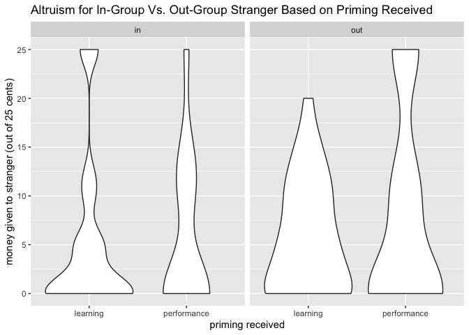<!-- -->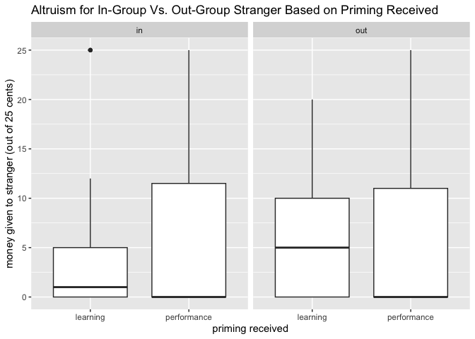<!-- -->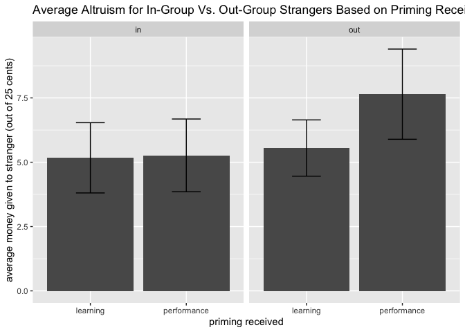<!-- -->

| inOrOut | priming_received |   n |     mean |       sd |       se | lower_ci |  upper_ci |
|:--------|:-----------------|----:|---------:|---------:|---------:|---------:|----------:|
| in      | learning         |  35 | 5.171429 | 8.074964 | 1.364918 | 2.496189 |  7.846668 |
| in      | performance      |  30 | 5.266667 | 7.741217 | 1.413346 | 2.496508 |  8.036826 |
| out     | learning         |  29 | 5.551724 | 5.889374 | 1.093629 | 3.408211 |  7.695238 |
| out     | performance      |  31 | 7.645161 | 9.758922 | 1.752754 | 4.209763 | 11.080559 |

**Description of graph:**

**Hypothesis based on graph:**

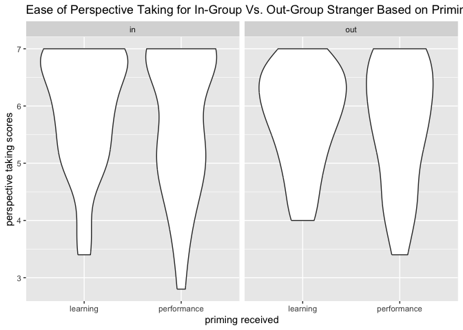<!-- -->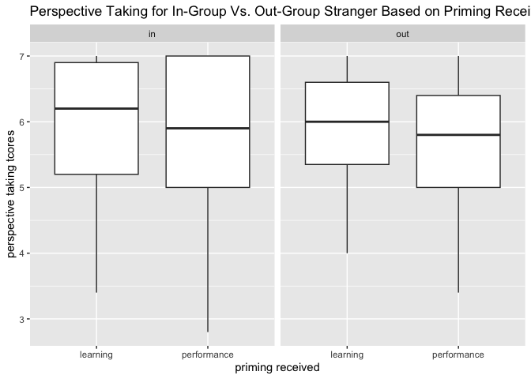<!-- -->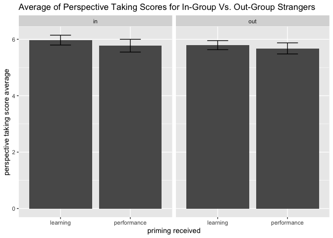<!-- -->

| inOrOut | priming_received |   n |     mean |        sd |        se | lower_ci | upper_ci |
|:--------|:-----------------|----:|---------:|----------:|----------:|---------:|---------:|
| in      | learning         |  35 | 5.971429 | 1.0325786 | 0.1745376 | 5.629335 | 6.313522 |
| in      | performance      |  30 | 5.773333 | 1.2403930 | 0.2264637 | 5.329464 | 6.217202 |
| out     | learning         |  31 | 5.793103 | 0.8643458 | 0.1552411 | 5.488831 | 6.097376 |
| out     | performance      |  32 | 5.677419 | 1.0926145 | 0.1931488 | 5.298848 | 6.055991 |

**Description of graph:**

**Hypothesis based on graph:**

**Overall Summary of second section:**

# References

Bettencourt, B.Ann, Kelly Charlton, and Cyndi Kernahan. 1997. “Numerical
Representation of Groups in Cooperative Settings: Social Orientation
Effects on Ingroup Bias.” *Journal of Experimental Social Psychology* 33
(6): 630–59. <https://doi.org/10.1006/jesp.1997.1334>.

Wang, Chenbo, Bing Wu, Yi Liu, Xinhuai Wu, and Shihui Han. 2015.
“Challenging Emotional Prejudice by Changing Self-Concept: Priming
Independent Self-Construal Reduces Racial in-Group Bias in Neural
Responses to Other’s Pain.” *Social Cognitive and Affective
Neuroscience* 10 (9): 1195–1201. <https://doi.org/10.1093/scan/nsv005>.

