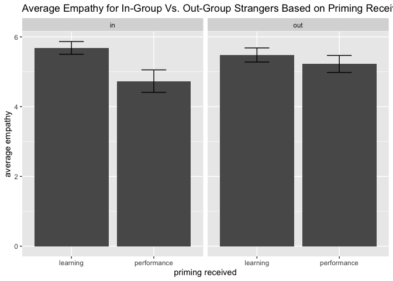
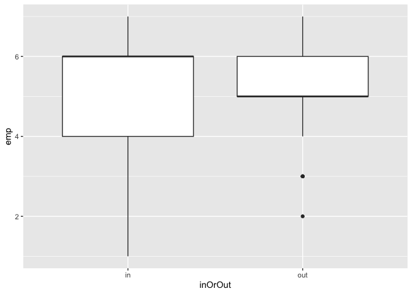
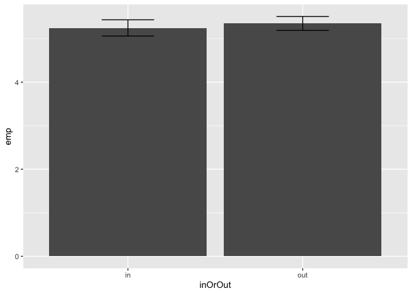

Can a Learning Orientation Reduce In-Group Bias?
================
Kaylee Billstone, Paulina Brown, Jaqueline Marroquin, Christian Ozuna,
Kirsten Richards, and Kennedy Zapalac
2023-10-02

# Project Overview

**What is in-group bias and why does it matter?**

In-group bias is the preferential treatment of people with whom you
share a common identity, such as gender, race, or culture. In-group bias
can be harmful when it leads to unfair outcomes, such as when a
perfectly qualified job candidate is not hired because of their race.
Current research is focused on reducing in-group bias to mitigate its
harmful effects.(Wang et al. 2015)

**Our aims:**

Along this line, we are investigating if in-group bias can be influenced
by priming people with a learning versus performance orientation. A
learning orientation is other-focused (trying to get to know another
person), whereas as performance orientation is self-focused (trying to
make a good impression). Other studies have demonstrated that in-group
bias is influenced by the priming received, so we expect the priming our
participants received will affect their in-group bias (Bettencourt,
Charlton, and Kernahan 1997). Specifically, we will:

1.  Determine how perspective taking, empathetic concern, and altruism
    is different among in-group versus out-group members. Do our
    participant’s display an in-group bias such that they have an easier
    time understanding, express more empathy for, and exhibit altruistic
    behavior toward in-group members?
2.  Determine if the priming received (learning versus performance)
    influenced perspective taking, empathetic concern, and altruism
    towards out-group members.

A few other aims we could pursue later:

1.  How does trait-level orientation influence the effectiveness of the
    priming received in reducing in-group bias?
2.  Investigate whether there are gender-related differences in the
    effectiveness of the learning orientation prime in reducing in-group
    bias.
3.  Perform textual analysis on the participants’ responses to the
    person going through a hard time. We could extract additional
    variables, which could be used to understand in-group bias. For
    example, can we use the sentiment expressed to predict how
    empathetic someone rated themselves as? Could we predict if someone
    had received a learning or performance orientation prime based on
    their language? Or does someone’s trait-level orientation strongly
    influence their language usage?

**Our dataset:**

Our dataset can be accessed
[here](https://github.com/kzapalac/SDS322E_project/blob/main/LP_Dictator.csv).
You can also reference the survey outline
[here](https://github.com/kzapalac/SDS322E_project/blob/main/LP_Dictator.pdf)
to understand the dataset better.

The sample includes white adults who identified as male or female, and
the survey was conducted entirely online. Participants were asked to
write a paragraph about themselves, and they received a learning or
performance prime. Next, they read about a gender-matched in-group or
out-group member (e.g., white or black stranger) going through a hard
time. Then, the participants wrote a letter of support to this person,
filled out a 5-item questionnaire about how easy it was to take the
other person’s perspective, a 1-item measure about how much empathetic
concern they felt for the person, and play a one-shot dictate game.
Trait-level learning and performance orientation was also assessed.
There were two quality measures, which may reduce the size of the
dataset, including an attention check and asking whether or not their
responses should be included.

Overall, there are:

- 2 independent variables: in-group/out-group stranger and
  learning/performance orientation

- 3 dependent variables: perspective taking, empathetic concern,
  altruism (via dictator game)

- 2 potential covariates: trait level learning/performance orientation,
  gender

# Exploratory Data Analysis

``` r
library(tidyverse)
```

    ## ── Attaching core tidyverse packages ──────────────────────── tidyverse 2.0.0 ──
    ## ✔ dplyr     1.1.2     ✔ readr     2.1.4
    ## ✔ forcats   1.0.0     ✔ stringr   1.5.0
    ## ✔ ggplot2   3.4.3     ✔ tibble    3.2.1
    ## ✔ lubridate 1.9.2     ✔ tidyr     1.3.0
    ## ✔ purrr     1.0.2     
    ## ── Conflicts ────────────────────────────────────────── tidyverse_conflicts() ──
    ## ✖ dplyr::filter() masks stats::filter()
    ## ✖ dplyr::lag()    masks stats::lag()
    ## ℹ Use the conflicted package (<http://conflicted.r-lib.org/>) to force all conflicts to become errors

``` r
df <- read.csv("LP_Dictator_cleaned.csv")
df <- df %>% filter(startDate != "5/22/13 10:06")

# remove text from dg column


# might want to remove attention check and excluded responses
```

### In-Group vs. Out-Group Perspective Taking, Empathetic Concern, and Altruism

``` r
# empathy
df %>% filter(!is.na(inOrOut)) %>% ggplot(aes(y=emp, x = inOrOut)) + geom_violin()
```

    ## Warning: Removed 3 rows containing non-finite values (`stat_ydensity()`).

<!-- -->

``` r
df %>% filter(!is.na(inOrOut)) %>% ggplot(aes(y=emp, x = inOrOut)) + geom_boxplot()
```

    ## Warning: Removed 3 rows containing non-finite values (`stat_boxplot()`).

<!-- -->

``` r
df %>% filter(!is.na(inOrOut)) %>% ggplot(aes(y=emp, x = inOrOut)) + geom_bar(stat='summary') +
  geom_errorbar(stat='summary', width = 0.3)
```

    ## Warning: Removed 3 rows containing non-finite values (`stat_summary()`).

    ## No summary function supplied, defaulting to `mean_se()`

    ## Warning: Removed 3 rows containing non-finite values (`stat_summary()`).

    ## No summary function supplied, defaulting to `mean_se()`

<!-- -->

``` r
# altruism (dictator game) 
df %>% filter(!is.na(inOrOut)) %>% ggplot(aes(y=emp, x = inOrOut)) + geom_violin()
```

    ## Warning: Removed 3 rows containing non-finite values (`stat_ydensity()`).

<!-- -->

``` r
df %>% filter(!is.na(inOrOut)) %>% ggplot(aes(y=emp, x = inOrOut)) + geom_boxplot()
```

    ## Warning: Removed 3 rows containing non-finite values (`stat_boxplot()`).

<!-- -->

``` r
df %>% filter(!is.na(inOrOut)) %>% ggplot(aes(y=emp, x = inOrOut)) + geom_bar(stat='summary') +
  geom_errorbar(stat='summary', width = 0.3)
```

    ## Warning: Removed 3 rows containing non-finite values (`stat_summary()`).

    ## No summary function supplied, defaulting to `mean_se()`

    ## Warning: Removed 3 rows containing non-finite values (`stat_summary()`).

    ## No summary function supplied, defaulting to `mean_se()`

<!-- -->

### Influence of Priming on Out-Group Perspective Taking, Empathetic Concern, and Altruism

# References

<div id="refs" class="references csl-bib-body hanging-indent">

<div id="ref-bettencourt1997" class="csl-entry">

Bettencourt, B.Ann, Kelly Charlton, and Cyndi Kernahan. 1997. “Numerical
Representation of Groups in Cooperative Settings: Social Orientation
Effects on Ingroup Bias.” *Journal of Experimental Social Psychology* 33
(6): 630–59. <https://doi.org/10.1006/jesp.1997.1334>.

</div>

<div id="ref-wang2015" class="csl-entry">

Wang, Chenbo, Bing Wu, Yi Liu, Xinhuai Wu, and Shihui Han. 2015.
“Challenging Emotional Prejudice by Changing Self-Concept: Priming
Independent Self-Construal Reduces Racial in-Group Bias in Neural
Responses to Other’s Pain.” *Social Cognitive and Affective
Neuroscience* 10 (9): 1195–1201. <https://doi.org/10.1093/scan/nsv005>.

</div>

</div>
